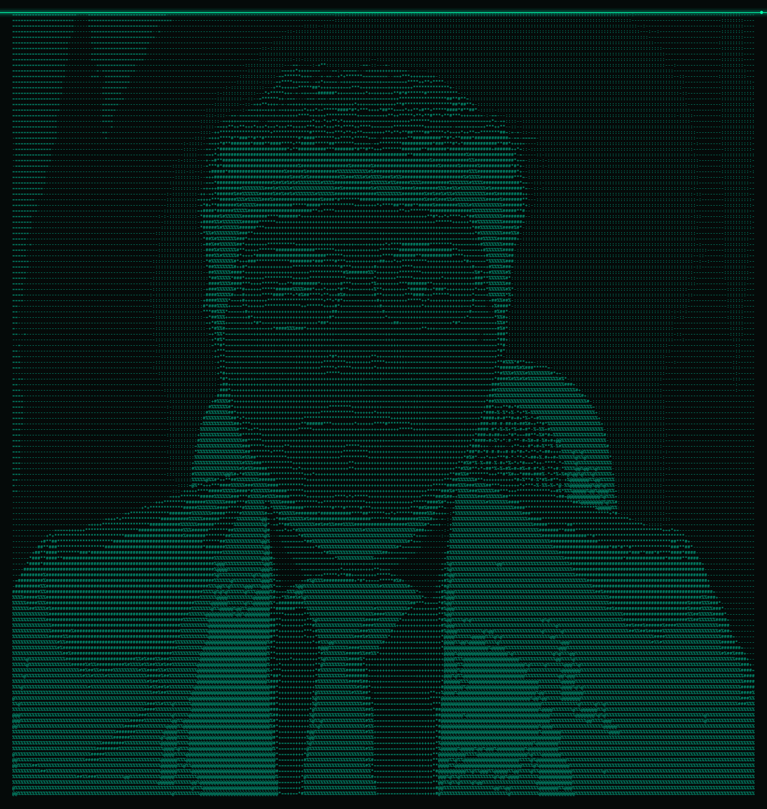
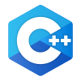

<div align="center">

# `ascv.dev`



<br>


<br><br>

**Estudiante de Ingeniería de Software · Desarrollo Mobile**

<br>

[](https://github.com/Alejandro-Choquehuanca)
[](https://www.java.com/)
[](https://isocpp.org/)
[](https://www.python.org/)

</div>

---

## `> sobre_mi`

Soy estudiante de **Ingeniería de Software** y actualmente
estoy orientando mi aprendizaje hacia el **Desarrollo de
Aplicaciones Móviles**.

Me interesa crear aplicaciones, aprender nuevas tecnologías
y mejorar continuamente mis habilidades de programación.

```text
Nombre      : Alejandro Samir Choquehuanca
Carrera     : Ingeniería de Software
Enfoque     : Desarrollo Mobile
Lenguajes   : Java · C++ · Python
Ubicación   : Lima, Perú


## `> Tecnologias`
    Lenguajes
 Java
C++
Python
JavaScript

    Herramientas
Git
GitHub
VS Code
IntelliJ IDEA
Linux


